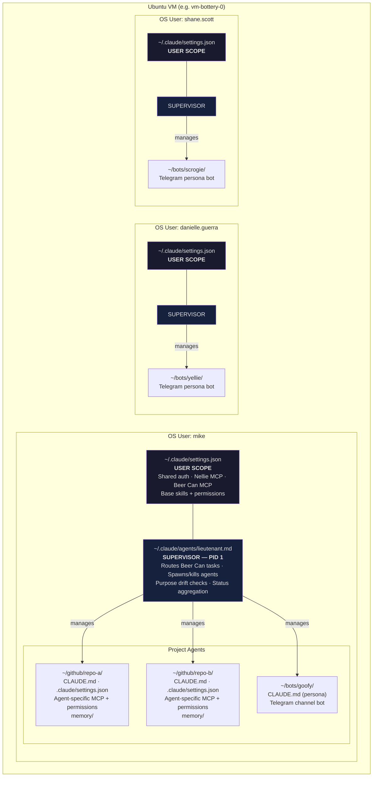
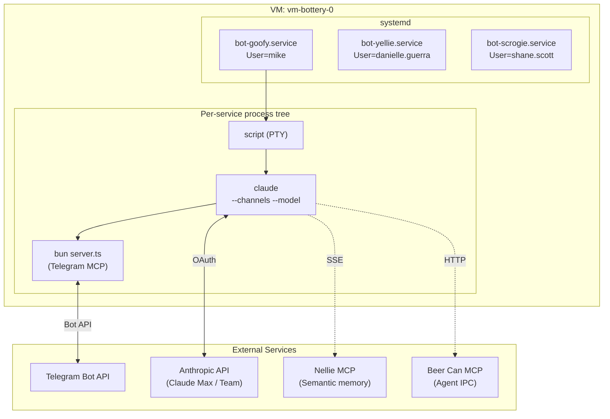
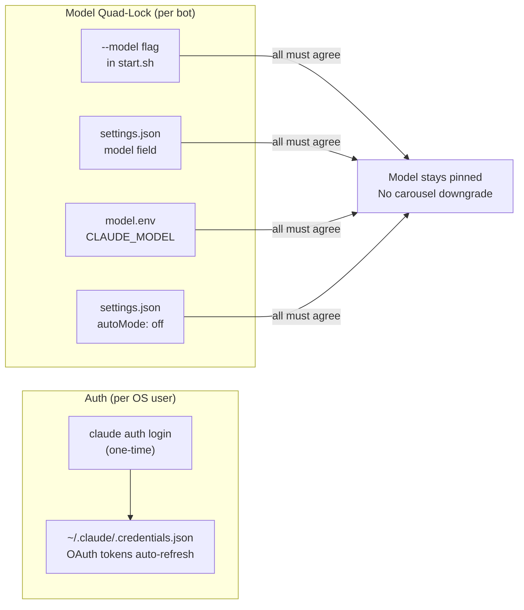
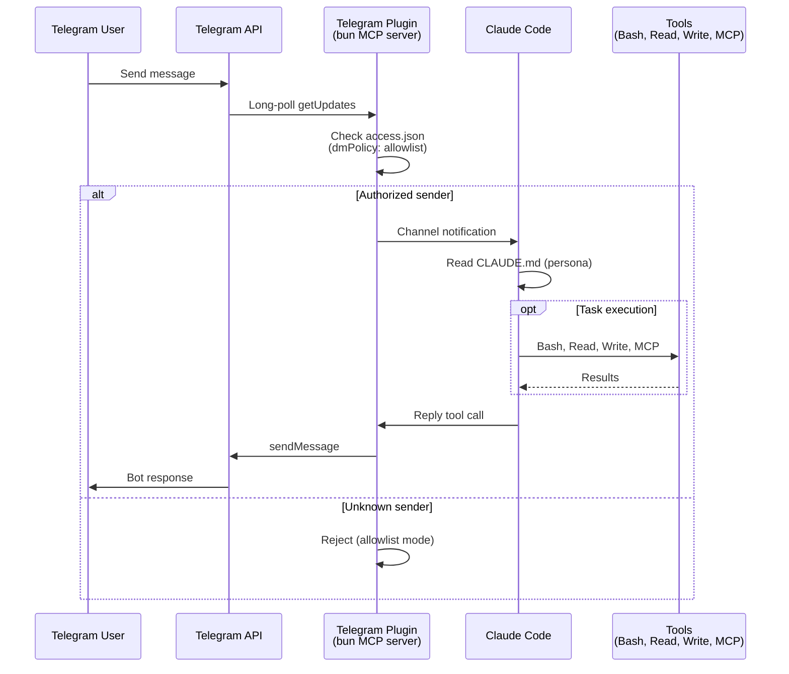
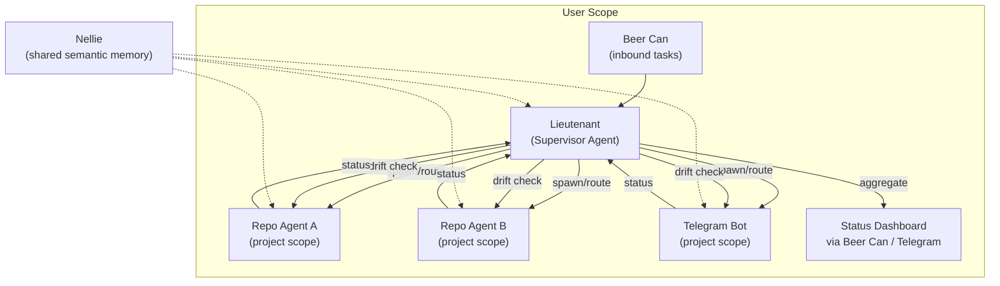

# Bottery v2 Architecture

Bottery v2 deploys Claude Code agents as systemd services on Ubuntu VMs. Each OS user is an auth boundary with one supervisor agent and N project/repo agents.

## Agent Hierarchy



### Scope Boundaries

| Scope | What lives here | Shared across |
|-------|----------------|---------------|
| **User** (`~/.claude/settings.json`) | OAuth creds, Nellie MCP, Beer Can MCP, base permissions | All agents under this OS user |
| **Supervisor** (`~/.claude/agents/lieutenant.md`) | Fleet management, task routing, drift checks | Sees all projects under this user |
| **Project** (`~/github/repo/.claude/settings.json`) | Agent persona, domain-specific MCP, repo-specific permissions, local memory | Only this agent |

Claude Code's native settings hierarchy IS the isolation layer — no containers needed.

## Deployment Architecture



### Process Tree (per bot)

Each systemd service runs four processes:

```
systemd
 └── start.sh
      └── script -q -c "claude ..." session.log    # PTY wrapper (required)
           └── claude --channels plugin:telegram     # Claude Code
                └── bun server.ts                    # Telegram MCP server (plugin-managed)
```

`script` provides a PTY — without it, CC enters `--print` mode and fails. The plugin manages its own bun process; never configure a manual `telegram` MCP server.

## Auth & Model Pinning



**Why quad-lock?** Without `autoMode: off`, CC's carousel silently downgrades the model (e.g. Opus → Haiku) when capacity is constrained.

**Allowed models:** claude-haiku-4-5-20251001, claude-sonnet-4-6, claude-opus-4-6. **Never** claude-opus-4-7.

## File Layout

```
/etc/claude-code/
  managed-settings.json              # {"channelsEnabled": true} (system-wide)

/home/USERNAME/
  .local/bin/claude                  # CC binary
  .bun/bin/bun                       # Bun runtime
  .claude/
    .credentials.json                # OAuth creds (from claude auth login)
    settings.json                    # User scope: skip prompts, shared MCP
    agents/
      lieutenant.md                  # Supervisor agent definition
    plugins/
      installed_plugins.json         # Plugin registry
      known_marketplaces.json        # Must point at THIS user's path
      cache/.../telegram/0.0.6/      # Plugin code
      marketplaces/.../              # Marketplace checkout
    channels/telegram/
      .env                           # TELEGRAM_BOT_TOKEN=...
      access.json                    # dmPolicy + allowlist
      model.env                      # CLAUDE_MODEL=...
  .claude.json                       # Onboarding state + project trust entries
  github/
    repo-a/                          # Repo agent working directory
      .claude/settings.json          # Project scope: agent-specific config
      CLAUDE.md                      # Agent purpose + persona
      memory/                        # Karpathy+ deep memory
  bots/
    botname/                         # Telegram persona bot
      CLAUDE.md                      # Persona
      start.sh                       # Launcher (script + claude)
      .mcp.json                      # Empty: {"mcpServers":{}}
      .git/                          # Required for CC project recognition
      .claude/settings.json          # Model, permissions, enabledPlugins, autoMode
      logs/
        debug.log                    # CC debug output
        session.log                  # PTY session capture

/etc/systemd/system/
  bot-BOTNAME.service                # systemd unit per bot
```

## Message Flow



## Supervisor Pattern (Lieutenant)



The lieutenant runs at user scope with visibility across all projects. It:
- **Routes** incoming Beer Can tasks to the correct project agent
- **Spawns/monitors/kills** project agents as needed
- **Checks purpose drift** — ensures agents stay on-task
- **Aggregates status** for the human operator

## VM Hardening

| Layer | Implementation |
|-------|---------------|
| Firewall | UFW — deny all incoming, allow SSH only |
| Brute force | fail2ban on SSH |
| SSH | Key-only auth, no root login, max 3 attempts |
| Patching | unattended-upgrades with auto-reboot at 04:00 UTC |
| Network | NSG locks SSH to admin WAN IP |
| Isolation | OS users — filesystem + process isolation between employees |
| Bot services | systemd Restart=always, RestartSec=10 — self-healing |
