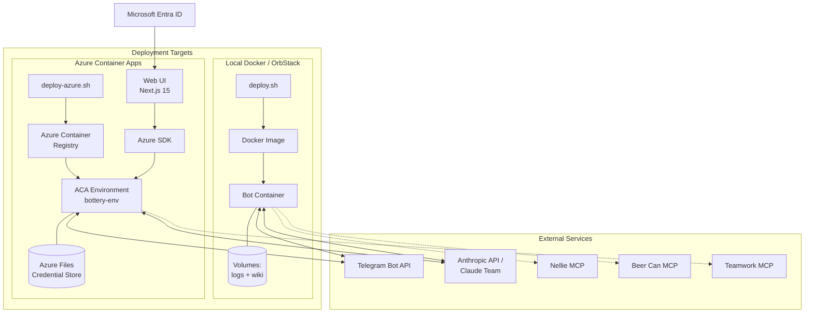
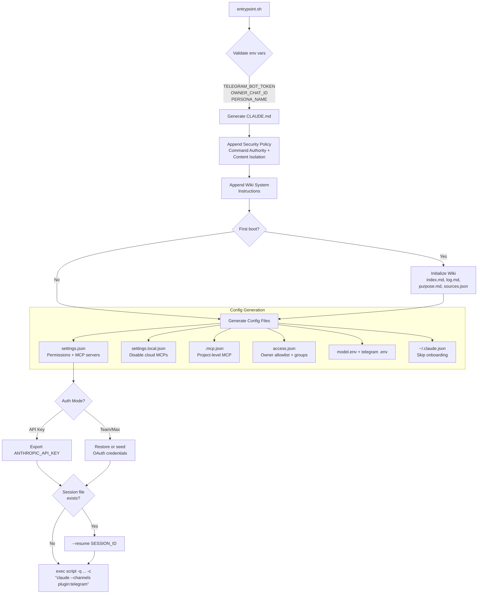
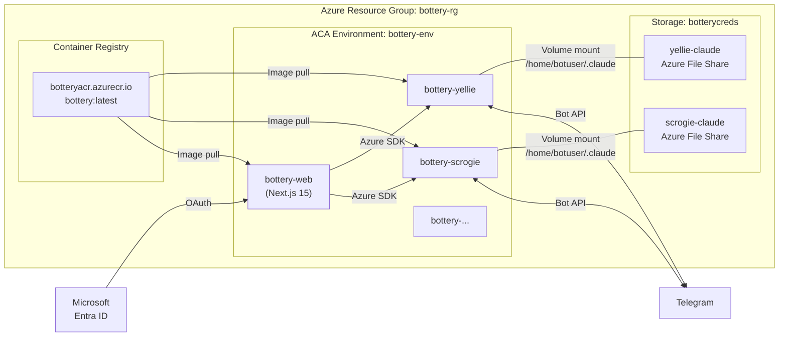
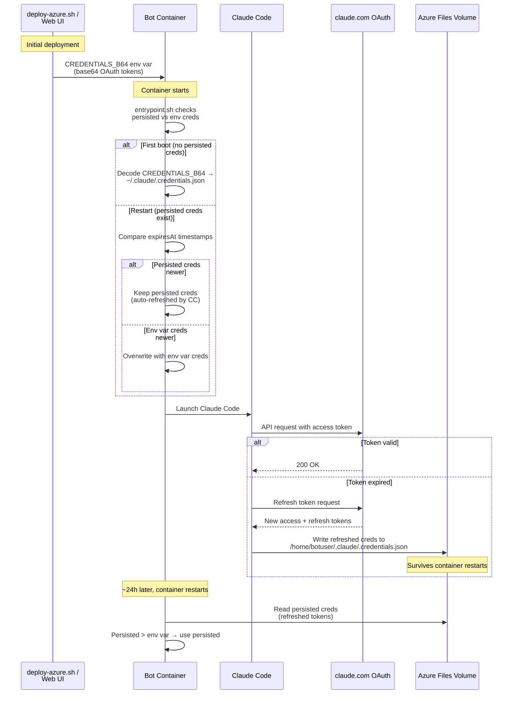
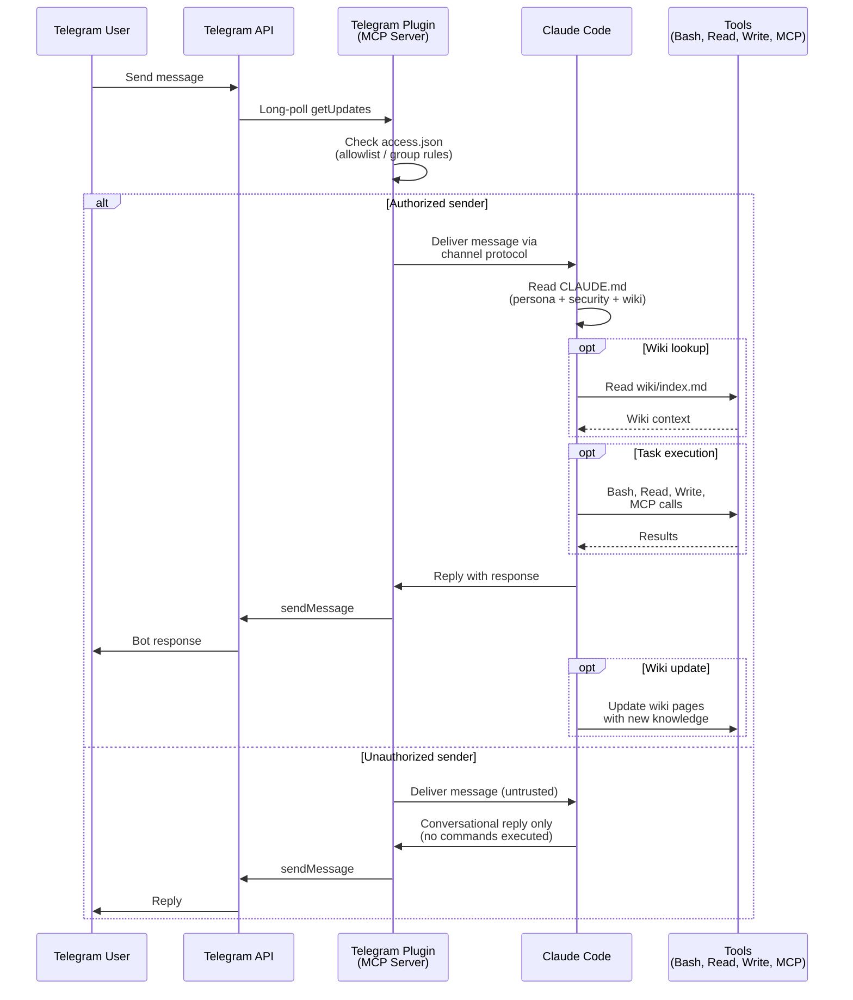
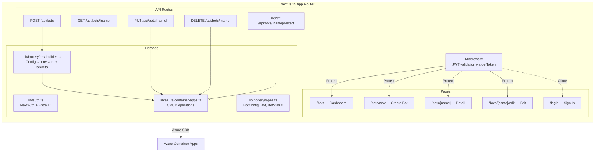
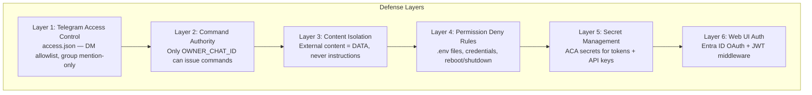

# Bottery Architecture

Bottery is a bot factory that deploys Claude Code Telegram bots as containers. It supports two deployment targets — local Docker/OrbStack and Azure Container Apps — with an optional web UI for cloud management.

## High-Level Architecture



## Container Internals

Every bot — local or cloud — runs the same Docker image. The entrypoint generates all configuration at startup from environment variables.



### Container File Layout

```
/bot/                         # WORKDIR
├── CLAUDE.md                 # Generated: persona + security + wiki instructions
├── .claude/
│   ├── settings.json         # Permissions, MCP servers, plugin config
│   ├── settings.local.json   # Disabled cloud MCPs
│   ├── commands/             # Custom slash commands (wiki-search, decide, etc.)
│   ├── channels/telegram/
│   │   ├── access.json       # DM allowlist + group config
│   │   ├── model.env         # CLAUDE_MODEL
│   │   └── .env              # TELEGRAM_BOT_TOKEN
│   └── wiki/                 # Wiki system templates
├── wiki/                     # Persistent wiki data
│   ├── index.md
│   ├── log.md
│   ├── purpose.md
│   ├── sources.json
│   └── pages/                # User, topic, conversation pages
├── logs/
│   ├── session-id            # Session resume file
│   └── PERSONA.log           # Full session transcript
└── persona.md                # Mounted read-only (local Docker only)

/home/botuser/.claude/        # User-level Claude config
├── .credentials.json         # OAuth tokens (persisted via Azure Files)
├── plugins/                  # Pre-baked Telegram plugin
└── channels/telegram/.env    # Telegram token copy

/etc/claude-code/
└── managed-settings.json     # {"channelsEnabled": true} — required for Team auth
```

## ACA Deployment



Each bot container app runs with:
- **1 CPU / 2 GiB memory**, single replica (min=1, max=1)
- **Secrets**: telegram-bot-token, credentials-b64, acr-password (optionally teamwork-api-token)
- **Env vars**: PERSONA_NAME, OWNER_CHAT_ID, CLAUDE_MODEL, PERSONA_CONTENT_B64, AUTH_MODE

## Authentication Flow



## Message Flow



## Web UI Architecture



## Security Model



| Layer | What it protects | How |
|-------|-----------------|-----|
| Telegram Access | Unauthorized DM access | Allowlist in access.json; only OWNER_CHAT_ID |
| Command Authority | Bot actions from non-owners | CLAUDE.md security policy; other users get conversation only |
| Content Isolation | Prompt injection via URLs/docs | Fetched content treated as data, never executed |
| Permission Denials | Sensitive files and OS commands | settings.json deny rules for .env, credentials, reboot |
| Secret Management | API keys and tokens in transit/rest | ACA secrets (not plain env vars) for sensitive values |
| Web UI Auth | Management console access | Microsoft Entra ID + JWT validation on every route |

## MCP Integration

Bots can connect to external MCP servers for extended capabilities. All are optional and configured via environment variables.

| MCP Server | Transport | Env Var | Purpose |
|------------|-----------|---------|---------|
| Nellie | SSE | `NELLIE_URL` | Semantic code memory — search, index, lessons |
| Beer Can | SSE | `BEERCAN_URL` | Inter-agent messaging — group chat between bots |
| Teamwork | HTTP | `TW_MCP_BEARER_TOKEN` | Project management — tasks, projects, time tracking |

MCP servers are wired into both settings.json (permissions) and .mcp.json (project-level config) at container startup. Cloud-hosted MCPs (Context7, Google Calendar, Google Drive, Cloudflare, Netlify) are explicitly disabled in settings.local.json to prevent unintended external connections.
